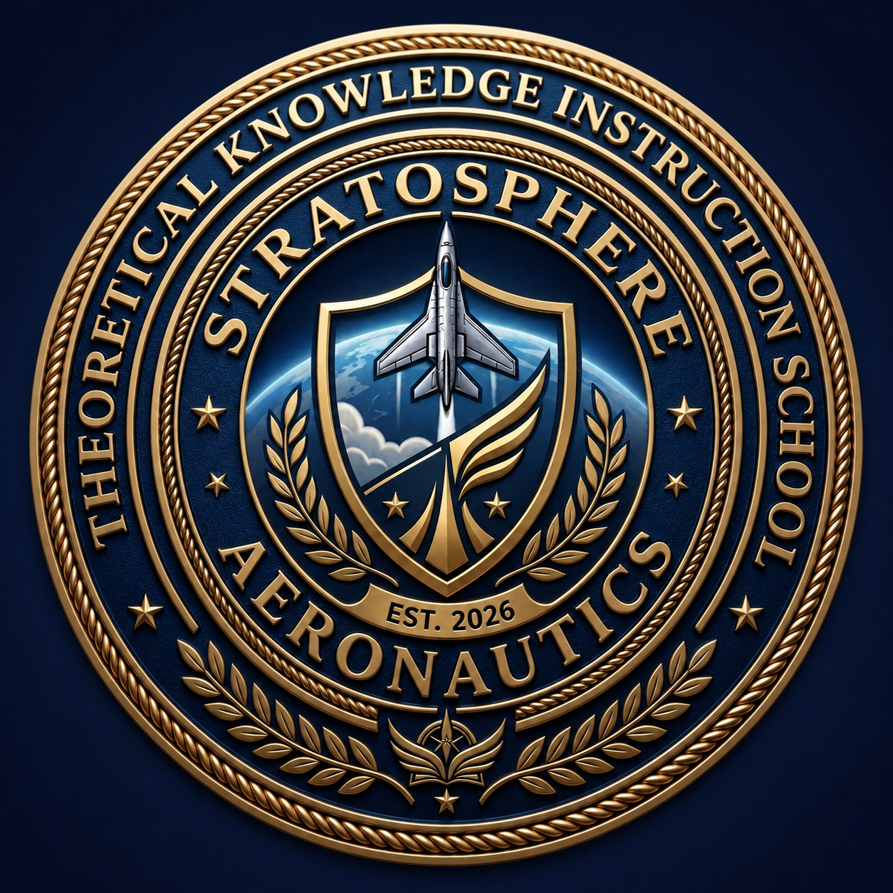

# ✈️ Stratosphere Aeronautics

### ERNAM Affiliated • ICAO Recognized • Regional Aviation Training Center

**Mastering the Skies. Managing the Future. Precision in Navigation.**

> "Precision in Theory. Excellence in Flight."

---

## 🌍 About Us

**Stratosphere Aeronautics School for Air Navigation & Management** is a premier aviation knowledge institution based in **Hargeisa, Somaliland**, dedicated to developing the next generation of aviation professionals through internationally aligned theoretical instruction.

Our training programs follow **ICAO standards** and the educational framework of **ERNAM (Regional School of Air Navigation and Management)**, providing students with the knowledge foundation required for successful aviation careers.

---

## 🚀 Highlights

- ICAO Recognized Standards
- ERNAM Affiliated Training
- 10+ Core Training Areas
- 5+ Career Pathways
- Internationally Certified Instructors
- Private & Small-Group Tuition
- PPL & CPL Foundation Preparation

---

## 🎯 Mission

> To empower the next generation of aviation leaders through rigorous air navigation training and comprehensive systems management education.

---

## 🔭 Vision

To become the leading aviation theoretical knowledge institution in the Horn of Africa, producing highly competent aviation professionals recognized globally for excellence, safety, and integrity.

---

## 📚 Training Areas

### Air Law
Rules of the air, international regulations, and operational procedures governing global airspace.

### Principles of Flight
Aerodynamics, aircraft systems, performance, and the physics of flight.

### Meteorology
Understanding weather patterns, atmospheric science, and safe operational decision-making.

### Navigation & Flight Planning
Master the mathematics and technology behind precision navigation and route planning.

### Aircraft General Knowledge
Comprehensive understanding of aircraft systems, powerplants, and airframe components.

### Human Performance
Physiological and psychological factors affecting pilot performance and decision-making.

### Radio Communications
Standard phraseology, communication procedures, and frequency management.

### Air Traffic Control & AIM
ATC procedures, airspace structure, and aeronautical information management.

### Safety Management Systems (SMS)
Risk assessment, hazard identification, and aviation safety culture.

### Language Proficiency Testing
Preparation for ICAO English Language Proficiency requirements.

---

## 💼 Career Pathways

### Flight Operations
- Flight Dispatcher
- Flight Operations Officer
- Flight Follower

### Logistics & Ground Handling
- Aviation Logistics Coordinator
- Ramp Operations Supervisor
- Loadmaster
- Weight & Balance Officer

### Safety & Compliance
- Safety Assistant (SMS)
- Compliance Coordinator

### Technical & Administrative Support
- Technical Records Specialist
- Meteorological Assistant
- Crew Scheduler

### Advanced Training
- Pathway to PPL Licensing
- Pathway to CPL Licensing
- Aviation Training Foundation

---

## ⭐ Why Choose Stratosphere Aeronautics?

### 👨‍✈️ Private 1-on-1 Sessions
Dedicated instruction tailored to your pace and learning style.

### 🌐 ICAO & ERNAM Aligned
Curriculum designed according to international aviation standards.

### 🎓 Experienced Instructors
Learn from seasoned aviation professionals with real-world operational experience.

### ⏰ Flexible Scheduling
Morning, evening, and weekend study options.

### 📍 Strategic Location
Located in Hargeisa, Somaliland.

---

## 🏢 Institution Profile

| Item | Details |
|--------|---------|
| Institution | Stratosphere Aeronautics |
| Established | 2026 |
| Location | Hargeisa, Somaliland |
| Training Type | Theoretical Knowledge Instruction (TKI) |
| Affiliation | ERNAM |
| Standards | ICAO Compliant |
| Focus | Air Navigation & Aviation Management |

---

## 🛡️ Core Values

- Precision
- Safety
- Integrity
- Excellence
- Professionalism
- Innovation

---

## 🤝 Partners & Standards

- ICAO (International Civil Aviation Organization)
- ERNAM (Regional School of Air Navigation and Management)
- ASECNA Framework
- ICAO WACAF Standards

---

## 🙏 Special Thanks

This project was supported by:

### FIKRADO Organization

🔗 https://github.com/fikrado-orgnasation

### FIKRADO DEV

🔗 https://github.com/fikrado

Thank you for supporting innovation, education, and technology development in Somaliland and across Africa.

---

## 📞 Contact

### Stratosphere Aeronautics
School for Air Navigation & Management

📍 Hargeisa, Somaliland

✈️ *Mastering the Skies. Managing the Future.*

---

## © License

Copyright © 2026 Stratosphere Aeronautics. All Rights Reserved.

