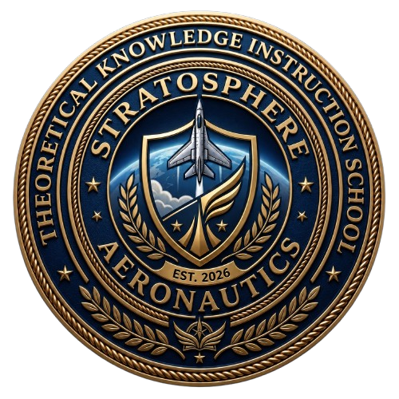

# ✈️ Stratosphere Aeronautics

### School of Theoretical Knowledge Instruction (TKI) · Hargeisa, Somaliland



**Precision in theory. Excellence in flight.**

Stratosphere Aeronautics is an ICAO-aligned theoretical knowledge instruction school in
Hargeisa, Somaliland. Students can register for one subject or build a complete theory
programme with private, one-to-one instruction from ERNAM-trained instructors.

## What the site includes

- Ten-subject TKI syllabus: Air Law, Principles of Flight, Meteorology, Navigation and Flight
  Planning, Aircraft General Knowledge, Human Performance, Radio Communications, ATC and AIM,
  Safety Management Systems, and Language Proficiency.
- Registration flow with subject selection, WhatsApp enquiry, and an enquiry form.
- Books and study packs held at the school.
- About, syllabus, programme detail, careers, student life, and contact pages.
- Responsive, accessible design with reduced-motion support and an instrument-panel visual system.
- Supabase edge function and migration for sending contact inquiries.

## Run locally

```bash
npm install
npm run dev
```

Open `http://localhost:5173`.

## Verify and build

```bash
npm run typecheck
npm run build
```

## Contact

**Stratosphere Aeronautics**  
Bahsane Building, 2nd Floor, Room 213  
Western entrance, facing west · Opposite the former National Cinema  
Hargeisa, Somaliland

- +252 63 4482830
- +252 65 4482830
- +252 63 3347512
- info@stratosphereaeronautics.com
- https://wa.me/252634482830

## Standards and affiliations

ICAO aligned · ERNAM trained · ASECNA partner · ICAO WACAF

© 2026 Stratosphere Aeronautics
